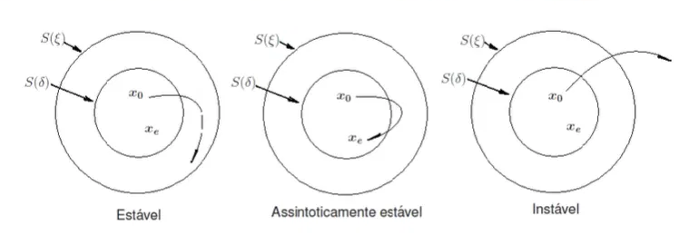

# Estabilidade segundo Lyapunov e Equações Diferenciais Lineares Homogêneas


## Índice

1. [Análise de estabilidade segundo Lyapunov](#1-análise-de-estabilidade-segundo-lyapunov)
2. [Equações diferenciais lineares de 1ª ordem homogêneas](#2-equações-diferenciais-lineares-de-1ª-ordem-homogêneas)
3. [Equações diferenciais lineares de 2ª ordem homogêneas](#3-equações-diferenciais-lineares-de-2ª-ordem-homogêneas)
4. [Síntese geral](#4-síntese-geral)


## 1. Análise de estabilidade segundo Lyapunov

### 1.1 O sistema dinâmico

Considere o sistema dinâmico descrito pela equação

```math
\dot{x}(t) = f(t,x) \qquad (1)
```

com condição inicial $x(0) = x_0$ conhecida.

Os **pontos de equilíbrio** $x_e$ são determinados de maneira que

$$f(t, x_e) = 0, \quad \forall t \geq 0$$

Ou seja, $x_e$ é um ponto onde, uma vez que o sistema esteja nele, ele permanece parado (sem variação no tempo).

### 1.2 As regiões do espaço de estado

Considere $S(\delta)$ e $S(\xi)$ regiões do espaço de estado tais que, para todo $t > 0$:

$$\|x(t) - x_e\| \leq \delta \quad \text{e} \quad \|x(t) - x_e\| \leq \xi$$

**Pontos-chave sobre essas regiões:**

- Ambas são definidas **em torno do ponto de equilíbrio $x_e$**, e não da origem do sistema de coordenadas. Só coincidem com a origem se $x_e = 0$.
- $x_e$ ocupa o **centro fixo** de ambas as regiões.
- $x_0$ (condição inicial real da trajetória) está localizado **dentro de $S(\delta)$**, mas não precisa — e geralmente não deve — coincidir com $x_e$.
- $S(\delta)$ (região interna, menor) é a "área de partida permitida"; $S(\xi)$ (região externa, maior) é o "limite de tolerância" que a trajetória não pode ultrapassar. Portanto $\delta \leq \xi$.


### 1.3 Definições de estabilidade

Um ponto de equilíbrio $x_e$ do sistema (1) é:

| Classificação | Definição formal | Interpretação |
|---|---|---|
| **Estável** (sentido de Lyapunov) | Para cada $S(\xi)$ existe um $S(\delta)$, tal que para toda condição inicial $x_0 \in S(\delta)$, a trajetória de estado **não deixa** $S(\xi)$ à medida que $t$ aumenta | A trajetória fica confinada, mas não precisa convergir |
| **Assintoticamente estável** | É estável no sentido de Lyapunov **e**, para toda condição inicial $x_0 \in S(\delta)$, a trajetória **converge** para $x_e$ sem deixar $S(\xi)$, à medida que $t$ aumenta | A trajetória fica confinada **e** converge para $x_e$ |
| **Instável** | Para algum $S(\xi)$ e $S(\delta)$, por menor que sejam, há sempre uma condição inicial $x_0 \in S(\delta)$ tal que a trajetória deixa $S(\xi)$ | A trajetória escapa da região de tolerância, não importa quão perto de $x_e$ ela comece |

### 1.4 Ordem lógica da definição — por que $\xi$ vem antes de $\delta$

Repare que a definição diz "**para cada** $S(\xi)$ **houver um** $S(\delta)$". Isso significa:

1. Primeiro escolhe-se a tolerância $\xi$ (quão longe do equilíbrio o sistema pode ir);
2. Depois pergunta-se se existe um raio de partida $\delta$ pequeno o suficiente que garanta que a trajetória nunca ultrapasse $\xi$.

### 1.5 Distinção fundamental: estável ≠ convergente

Este é o ponto mais sutil (e mais importante) da análise qualitativa:

- **Estabilidade (sem "assintótica")** garante apenas que a trajetória **não diverge** — ela fica confinada em $S(\xi)$ para sempre.
- A definição **não afirma nem nega** convergência para $x_e$. Ela é *omissa*, não *negativa*, quanto a esse ponto.
- **Estabilidade assintótica** é uma condição **mais forte**: exige estabilidade **e** convergência.

**Exemplo físico clássico:** o pêndulo ideal (sem atrito), com equilíbrio na posição vertical inferior.

- Se deslocado ligeiramente, oscila **para sempre**, com amplitude constante.
- Nunca escapa (não diverge) → **estável**.
- Nunca converge para o ponto de equilíbrio → **não é assintoticamente estável**.

Já o pêndulo **com atrito** dissipa energia, as oscilações diminuem de amplitude, e a trajetória converge → **assintoticamente estável**.

| Situação | Estável? | Converge? |
|---|---|---|
| Pêndulo sem atrito (oscila para sempre) | Sim | Não |
| Pêndulo com atrito (converge) | Sim | Sim |

Ou seja: **todo sistema assintoticamente estável é estável, mas nem todo sistema estável é assintoticamente estável.**

### 1.6 Figura 1 — Estabilidade dos pontos de equilíbrio

Representação esquemática (círculo externo $S(\xi)$, círculo interno $S(\delta)$, $x_e$ no centro, $x_0$ como ponto de partida deslocado):



---

## 2. Equações diferenciais lineares de 1ª ordem homogêneas

### 2.1 Formulação e solução

Os sistemas dinâmicos são descritos por equações diferenciais, e a estabilidade é sua propriedade mais importante.

Considere a equação diferencial linear de primeira ordem e homogênea:

```math
\frac{dx(t)}{dt} = \alpha x(t)  \qquad (2)
```

com condição inicial $x(0) = x_0$ conhecida, sendo $\alpha$ uma constante real.

**Resolução por separação de variáveis:**

```math
\frac{dx(t)}{dt} = \alpha x(t) \Rightarrow \frac{1}{x(t)}dx(t) = \alpha \, dt
```

```math
\int_{x_0}^{x(t)} \frac{1}{x(t)}dx(t) = \alpha \int_0^t dt \Rightarrow \ln(x(t))\Big|_{x_0}^{x(t)} = \alpha t \Big|_0^t
```

```math
\ln(x(t)) - \ln(x_0) = \alpha t \Rightarrow \ln(x(t)) = \ln(x_0) + \alpha t
```

```math
e^{\ln(x(t))} = e^{(\ln(x_0)+\alpha t)} = e^{\ln(x_0)}e^{\alpha t}
```

```math
\boxed{x(t) = x_0 e^{\alpha t}}  \qquad (3)
```

### 2.2 Ponto de equilíbrio

O ponto de equilíbrio $x_e$ é alcançado quando $dx(t)/dt = 0$, ou seja:

```math
\alpha x_e = 0 \Rightarrow x_e = 0 \quad (\text{para } \alpha \neq 0)
```

### 2.3 Estabilidade em função do sinal de $\alpha$

Como a solução analítica $x(t) = x_0 e^{\alpha t}$ está disponível de forma explícita, a estabilidade pode ser lida diretamente do sinal de $\alpha$:

| Sinal de $\alpha$ | Comportamento de $x(t)$ | Classificação |
|---|---|---|
| $\alpha < 0$ | $x(t) \to 0$ quando $t \to \infty$ (decaimento exponencial) | **Assintoticamente estável** |
| $\alpha = 0$ | $x(t) = x_0$ (constante) | **Estável** (não assintoticamente) |
| $\alpha > 0$ | $x(t) \to \infty$ (crescimento exponencial) | **Instável** |

### 2.4 Exemplos numéricos (condição inicial $x_0 = 5$)

**Sistema assintoticamente estável — $\alpha = -1$:**

$$x(t) = 5e^{-t}$$

A curva decai suavemente de $x_0=5$ até se aproximar de $0$, sem nunca ultrapassar o valor inicial em módulo.

**Sistema instável — $\alpha = 1$:**

$$x(t) = 5e^{t}$$

A curva cresce exponencialmente, atingindo valores da ordem de centenas já em $t=5$.

---

## 3. Equações diferenciais lineares de 2ª ordem homogêneas

### 3.1 Formulação geral

Considere a equação diferencial linear de segunda ordem e homogênea:

```math
\frac{d^2x(t)}{dt^2} + a\frac{dx(t)}{dt} + bx(t) = 0  \qquad (4)
```

para condições iniciais $x(0) = x_0$ e $\frac{dx(0)}{dt} = \frac{dx_0}{dt}$ conhecidas, com $a$ e $b$ constantes reais.

### 3.2 Equação característica

Propõe-se uma solução do mesmo tipo da equação de 1ª ordem: $x(t) = e^{\alpha t}$. Substituindo na equação (4), com $\frac{dx(t)}{dt} = \alpha e^{\alpha t}$ e $\frac{d^2x(t)}{dt^2} = \alpha^2 e^{\alpha t}$:

$$\alpha^2 e^{\alpha t} + a\alpha e^{\alpha t} + be^{\alpha t} = 0 \Rightarrow e^{\alpha t}(\alpha^2 + a\alpha + b) = 0  \qquad (5)$$

Como $e^{\alpha t}$ nunca se anula, uma condição suficiente para que (5) seja satisfeita é:

$$\alpha^2 + a\alpha + b = 0  \qquad (6)$$

Essa é a **equação característica**, com duas raízes $\alpha_1$ e $\alpha_2$, cuja natureza (reais distintas, reais duplas, ou complexas conjugadas) determina o comportamento da solução.

Obs: Note que $x_0$ não aparece quando obtemos a equação característica, como observado na 1ª Ordem, já que ela se anula quando analisamos em (5).

### 3.3 Princípio da superposição

Se $f_1(t) = e^{\alpha_1 t}$ e $f_2(t) = e^{\alpha_2 t}$ satisfazem a equação (4) (exceto pelas condições iniciais), então a combinação linear $f(t) = k_1 f_1(t) + k_2 f_2(t)$ também satisfaz.

> Isso decorre do Princípio da Superposição: para um sistema linear e invariante no tempo (SLIT), se $u_1(t) \to y_1(t)$ e $u_2(t) \to y_2(t)$, então $\alpha_1 u_1(t) + \alpha_2 u_2(t) \to \alpha_1 y_1(t) + \alpha_2 y_2(t)$, para quaisquer sinais e constantes reais.

A solução geral, portanto, é:

$$x(t) = k_1 e^{\alpha_1 t} + k_2 e^{\alpha_2 t}  \qquad (7)$$

---

### 3.4 Caso 1 — Raízes reais e distintas ($\alpha_1 \neq \alpha_2$)

Derivando (7):

$$\frac{dx(t)}{dt} = \frac{d (k_1 e^{\alpha_1 t} + k_2 e^{\alpha_2 t})}{dt} = k_1\alpha_1 e^{\alpha_1 t} + k_2\alpha_2 e^{\alpha_2 t}$$

Aplicando as condições iniciais de (4), em (7):

$$x(0) = k_1 e^{\alpha_1 0} + k_2 e^{\alpha_2 0}= k_1 + k_2 = x_0$$

$$\frac{dx(0)}{dt} = k_1\alpha_1 e^{\alpha_1 0} + k_2\alpha_2 e^{\alpha_2 0} = k_1\alpha_1 + k_2\alpha_2 = \frac{dx_0}{dt}$$

Temos o sistema:

```math
\begin{cases} k_1 + k_2 = x_0 \\ k_1\alpha_1 + k_2\alpha_2 = \frac{dx_0}{dt} \end{cases}
```

Resolvendo o sistema (por substituição de $k_2 = x_0 - k_1$, e simetricamente $k_1 = x_0 - k_2$):

$$k_1 = \frac{-\frac{dx_0}{dt} + x_0\alpha_2}{\alpha_2 - \alpha_1}, \qquad k_2 = \frac{\frac{dx_0}{dt} - x_0\alpha_1}{\alpha_2 - \alpha_1}$$

Essa solução é **geral e única**, desde que $\alpha_2 - \alpha_1 \neq 0$, isto é, $\alpha_1 \neq \alpha_2$.

A solução geral, portanto, é:

$$x(t) = k_1 e^{\alpha_1 t} - k_2 e^{\alpha_2 t}$$


**Exemplo numérico:** $a = 5$, $b = 6$ → $\alpha_1 = -2$, $\alpha_2 = -3$. Com $x_0 = 5$ e $dx_0/dt = 2$:

$$k_1 = \frac{-2 + 5(-3)}{(-3)-(-2)} = 17, \qquad k_2 = \frac{2 - 5(-2)}{(-3)-(-2)} = -12$$

$$x(t) = 17e^{-2t} - 12e^{-3t}$$

**Estabilidade:**

| Caso | Raízes | Comportamento |
|---|---|---|
| Assintoticamente estável | $\alpha_1, \alpha_2 < 0$ | $x(t) \to 0$ (decaimento suave) |
| Instável | ao menos uma raiz $> 0$ | $x(t) \to \pm\infty$ (o termo de maior expoente domina o crescimento) |

---

### 3.5 Caso 2 — Raízes reais e duplas ($\alpha_1 = \alpha_2 = \alpha$)

Se $\alpha_1 = \alpha_2 = \alpha$, a forma (7) se reduz a $x(t) = k_1e^{\alpha t} + k_2e^{\alpha t} = (k_1+k_2)e^{\alpha t} = k_3 e^{\alpha t}$ — **apenas uma constante livre**, insuficiente para satisfazer duas condições iniciais em geral.

**A segunda solução independente:** propõe-se $x(t) = te^{\alpha t}$, com

$$\frac{dx(t)}{dt} = t\alpha e^{\alpha t} + e^{\alpha t}, \qquad \frac{d^2x(t)}{dt^2} = t\alpha^2 e^{\alpha t} + 2\alpha e^{\alpha t} = \alpha e^{\alpha t}(t\alpha+2)$$

Substituindo em (4):

$$\frac{d^2x(t)}{dt^2} + a\frac{dx(t)}{dt} + bx(t) = te^{\alpha t}\underbrace{(\alpha^2+a\alpha+b)}_{f(\alpha)=0} + e^{\alpha t}\underbrace{(2\alpha+a)}_{f'(\alpha)=0}$$

O primeiro parêntese é nulo porque $\alpha$ é raiz da equação característica $f(\alpha) = \alpha^2+a\alpha+b=0$. O segundo também é nulo porque, quando a raiz é **dupla**, $\alpha$ satisfaz simultaneamente $f(\alpha)=0$ **e** $f'(\alpha) = 2\alpha+a = 0$ (condição matemática de multiplicidade dupla). Logo, $x(t)=te^{\alpha t}$ também é solução.

A solução geral passa a ser:

$$x(t) = k_1 e^{\alpha t} + k_2 t e^{\alpha t}  \qquad (8)$$

Aplicando as condições iniciais:

$$x(0) = k_1 = x_0$$

$$\frac{dx(t)}{dt} = e^{\alpha t}(k_1\alpha + k_2t\alpha + k_2) \Rightarrow \frac{dx(0)}{dt} = k_1\alpha + k_2 = \frac{dx_0}{dt} \Rightarrow k_2 = \frac{dx_0}{dt} - x_0\alpha$$

**Exemplo numérico:** $a=10$, $b=25$ → $\alpha = -5$ (raiz dupla). Com $x_0=5$, $dx_0/dt=2$:

$$k_1 = 5, \qquad k_2 = 2 - 5(-5) = 27$$

$$x(t) = 5e^{-5t} + 27te^{-5t}$$

**Estabilidade:** depende apenas do sinal da raiz repetida $\alpha$:

| Caso | $\alpha$ | Comportamento |
|---|---|---|
| Assintoticamente estável | $\alpha < 0$ | $x(t)\to 0$ (a exponencial decrescente domina o crescimento linear de $t$) |
| Instável | $\alpha > 0$ | $x(t)\to\infty$ |

---

### 3.6 Caso 3 — Raízes complexas conjugadas ($\alpha_{1,2} = \sigma \pm j\omega$, $\omega \neq 0$)

Quando $\alpha$ é raiz complexa, seu conjugado $\bar\alpha$ também é raiz. Assim, $\alpha_1 = \sigma+j\omega$ e $\alpha_2 = \sigma-j\omega$. Da equação (7):

$$x(t) = k_1e^{(\sigma+j\omega)t} + k_2e^{(\sigma-j\omega)t} = k_1e^{\sigma t}e^{j\omega t} + k_2e^{\sigma t}e^{-j\omega t}$$

Usando a **fórmula de Euler**, $e^{j\omega t} = \cos\omega t + j\,\text{sen}\,\omega t$:

$$x(t) = k_1e^{\sigma t}(\cos\omega t+j\,\text{sen}\,\omega t) + k_2e^{\sigma t}(\cos\omega t - j\,\text{sen}\,\omega t)$$

$$= e^{\sigma t}\big[(k_1+k_2)\cos\omega t + j(k_1-k_2)\text{sen}\,\omega t\big]  \qquad (9)$$

**Condições iniciais:** $x(0) = k_1+k_2 = x_0$. Derivando (9) e avaliando em $t=0$:

$$\frac{dx(0)}{dt} = \sigma(k_1+k_2) + j(k_1-k_2)\omega = \frac{dx_0}{dt} \Rightarrow j(k_1-k_2) = \frac{dx_0/dt - \sigma x_0}{\omega}$$

Substituindo em (9):

$$x(t) = e^{\sigma t}\left[x_0\cos\omega t + \frac{dx_0/dt - \sigma x_0}{\omega}\text{sen}\,\omega t\right]$$

**Exemplo numérico:** $a=4$, $b=53$ → $\alpha_{1,2} = -2 \pm j7$, logo $\sigma=-2$, $\omega=7$. Com $x_0=5$, $dx_0/dt=2$:

$$x(t) = e^{-2t}\left(5\cos 7t + \frac{2+2\times5}{7}\text{sen}\,7t\right) = e^{-2t}\left(5\cos 7t + \frac{12}{7}\text{sen}\,7t\right)$$

**A novidade:** ao contrário dos casos anteriores, aparecem termos $\cos\omega t$ e $\text{sen}\,\omega t$ — a solução é **oscilatória**. A envoltória $e^{\sigma t}$ modula a amplitude da oscilação.

**Estabilidade — determinada pela parte real $\sigma$:**

| Caso | $\sigma$ | Comportamento |
|---|---|---|
| Assintoticamente estável | $\sigma < 0$ | Oscilação **amortecida** (envoltória decrescente) — ex.: sistema massa-mola-amortecedor ou circuito RLC subamortecido |
| Instável | $\sigma > 0$ | Oscilação de **amplitude crescente** |

---

## 4. Síntese geral

### 4.1 Quadro-resumo dos três casos (2ª ordem)

| Caso | Raízes da eq. característica | Forma da solução | Comportamento típico |
|---|---|---|---|
| Reais e distintas | $\alpha_1 \neq \alpha_2$ (reais) | $x(t) = k_1e^{\alpha_1 t}+k_2e^{\alpha_2 t}$ | Decaimento/crescimento exponencial puro |
| Reais e duplas | $\alpha_1=\alpha_2=\alpha$ | $x(t) = k_1e^{\alpha t}+k_2te^{\alpha t}$ | Decaimento/crescimento exponencial (sem oscilar) |
| Complexas conjugadas | $\sigma\pm j\omega$ | $x(t)=e^{\sigma t}[\ldots\cos\omega t + \ldots\text{sen}\,\omega t]$ | Oscilação amortecida ou crescente |

### 4.2 Critério unificado de estabilidade

Em **todos** os casos analisados (1ª e 2ª ordem), a regra geral é a mesma:

> **Um sistema linear é assintoticamente estável se, e somente se, todas as raízes da equação característica possuem parte real negativa.**

- Para raízes reais, a "parte real" é a própria raiz.
- Para raízes complexas, é $\sigma = \text{Re}(\alpha)$.

Esse critério é a base para generalizações futuras na disciplina, como:

- Equações diferenciais lineares homogêneas de ordem $n$;
- Análise via **autovalores** da matriz de estados $A$ (representação em espaço de estados $\dot{x} = Ax$);
- **Critério de Routh-Hurwitz**, que permite verificar o sinal das partes reais das raízes **sem calculá-las explicitamente**;
- **Método direto de Lyapunov** (função candidata $V(x)$), que generaliza a análise de estabilidade para sistemas **não lineares**, onde geralmente não existe solução analítica fechada.

### 4.3 Conexão com a Seção 1 (Lyapunov)

Os exemplos de 1ª e 2ª ordem servem como **casos particulares e concretos** das definições abstratas de Lyapunov:

- Como a solução analítica $x(t)$ está sempre disponível nesses casos lineares, é possível verificar diretamente se a trajetória converge, permanece confinada ou diverge — sem precisar recorrer às regiões $S(\delta)$, $S(\xi)$ explicitamente.
- Essa verificação direta **deixa de ser possível** em sistemas não lineares mais gerais, que é exatamente a motivação para o método direto de Lyapunov, a ser estudado a seguir.

---

## Referências

- LORDELO, A. D. S. *ESTA020-17: Modelagem e Controle — Aula 1*. Slides de aula, UFABC, 2021.

---

*Material elaborado como notas de estudo, a partir dos slides da disciplina ESTA020-17 (Modelagem e Controle) — UFABC.*
